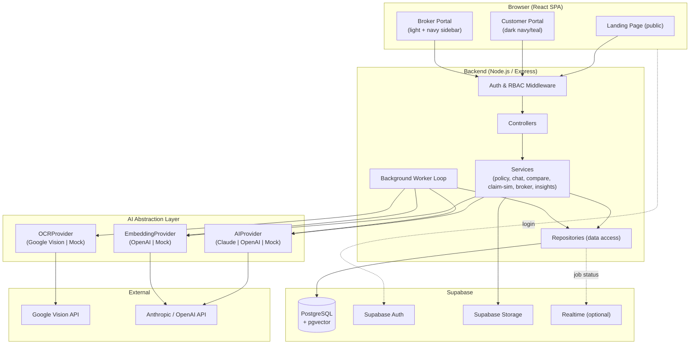
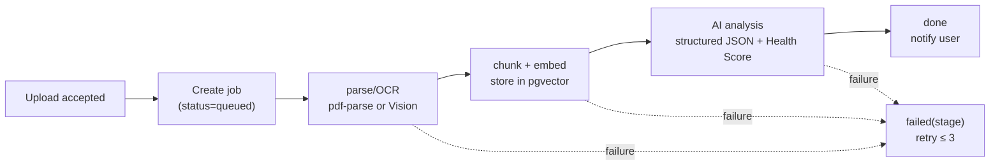
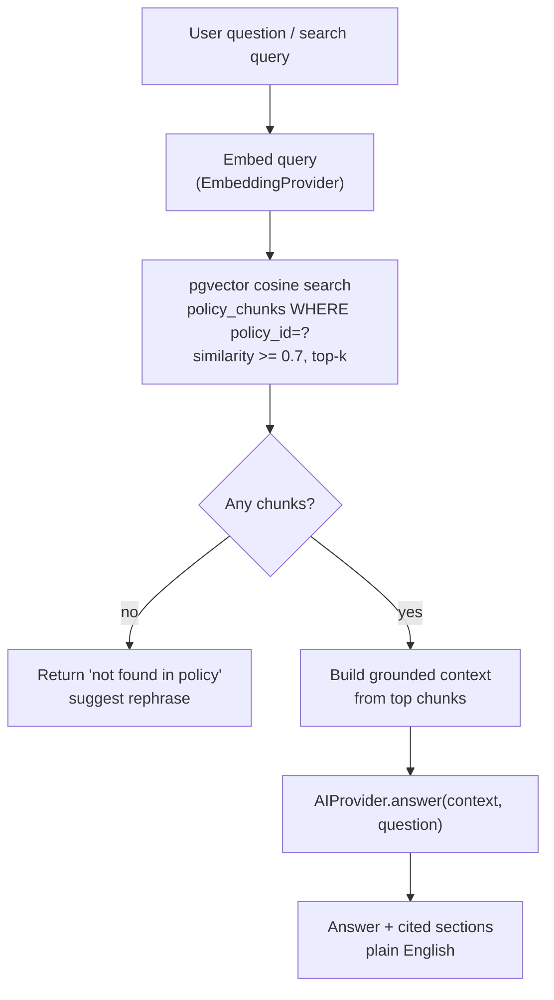
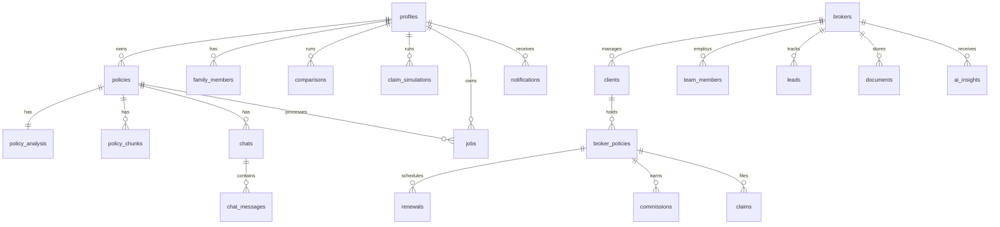

# Design Document

## Overview

PolicyLens is an AI-powered Insurance Intelligence Platform that turns dense insurance documents into clear, structured, actionable guidance. This design covers Phase 1: the **Customer Portal** (consumer AI app — dark navy/teal theme), the **Broker Portal** (CRM/CMS — light theme with navy sidebar), and the shared **AI Engine** (OCR + structured analysis + RAG chat + semantic search) with an asynchronous background processing pipeline.

The system is a monorepo with a React (Vite + Tailwind) single-page frontend, a Node.js/Express backend, and Supabase (PostgreSQL + Auth + Storage + pgvector) as the data platform. External intelligence comes from Google Vision (OCR) and a provider-agnostic LLM layer (Anthropic Claude or OpenAI). A first-class **Demo/Mock mode** lets the entire product run end-to-end with zero external API keys by substituting deterministic mock adapters, so development and evaluation are never blocked on credentials.

### Design Goals

1. **Runnable without keys** — mock adapters produce realistic analysis when keys are absent.
2. **Provider-agnostic AI** — swap Claude/OpenAI and embedding providers via config.
3. **Grounded answers** — chat and search are RAG-backed by pgvector; no hallucinated coverage claims.
4. **Simple infra for Phase 1** — Postgres-backed job queue (no Redis dependency).
5. **Security by default** — Supabase RLS on every table, role-based route guards, server-side secrets only.

### Requirements Addressed

All 21 requirements (R1–R21). A full mapping is in [Requirements Coverage](#requirements-coverage-mapping).

---

## Architecture

### System Architecture



### Background Processing Pipeline



Each stage transition writes a `stage` and `progress` value to the `jobs` row; the frontend polls `GET /api/jobs/:id` (2s interval) to render the Upload → Extract → Analyze → Done indicator (R1.6, R16.2).

### RAG Flow (Chat & Semantic Search)



---

## Project Structure

```
policylens/
├── SRS.md                        # Software Requirements Specification (deliverable)
├── README.md                     # Setup, architecture, run instructions (deliverable)
├── .env.example                  # All env vars documented
├── package.json                  # Root workspace scripts
├── docker-compose.yml            # Optional local Postgres+pgvector
├── shared/
│   └── types/                    # Shared TypeScript types (Policy, Analysis, Job, etc.)
├── backend/
│   ├── src/
│   │   ├── index.ts              # Express bootstrap
│   │   ├── config/               # env loading, provider selection
│   │   ├── middleware/           # auth, rbac, error handler, rate limit, upload
│   │   ├── routes/               # route definitions per portal
│   │   ├── controllers/          # request/response handling
│   │   ├── services/             # business logic
│   │   │   ├── ai/               # AIProvider, EmbeddingProvider, OCRProvider + adapters
│   │   │   ├── policy/           # parsing, chunking, analysis, health-score
│   │   │   ├── chat/             # RAG chat
│   │   │   ├── compare/          # policy comparison
│   │   │   ├── claimsim/         # claim simulator
│   │   │   ├── broker/           # broker CRM services
│   │   │   └── insights/         # AI insights
│   │   ├── repositories/         # Supabase data access
│   │   ├── worker/               # background job loop
│   │   └── utils/
│   ├── migrations/               # SQL migrations (schema, RLS, pgvector)
│   ├── seed/                     # demo seed data (broker + clients + policies)
│   └── tests/                    # unit, property-based (fast-check), integration
└── frontend/
    ├── src/
    │   ├── main.tsx
    │   ├── App.tsx               # role-based routing
    │   ├── lib/                  # api client, supabase client, query client
    │   ├── theme/                # customer (dark) + broker (light) tokens
    │   ├── context/              # AuthContext, ThemeContext
    │   ├── components/           # shared UI
    │   ├── layouts/              # CustomerLayout, BrokerLayout, PublicLayout
    │   ├── pages/
    │   │   ├── public/           # Landing, Login, Signup
    │   │   ├── customer/         # Upload, Dashboard, Chat, Vault, Compare, ClaimSim
    │   │   └── broker/           # Dashboard, Clients, Policies, Renewals, Premiums,
    │   │                          # Commission, Claims, Leads, AIAssistant, Reports,
    │   │                          # Analytics, Documents, Team, Settings
    │   └── hooks/
    └── tests/
```

---

## Technology Stack & Rationale

| Layer | Choice | Rationale |
|-------|--------|-----------|
| Frontend | React 18 + Vite + TypeScript | Fast dev, typed, matches user stack |
| Styling | Tailwind CSS | Utility-first; easy dual-theme tokens |
| Data fetching | TanStack React Query | Cache, polling for job status (R16), auto-refresh (R9.4) |
| Client state | React Context | Auth + theme; avoids heavier state libs for Phase 1 |
| Charts | Recharts | Premium/commission/coverage charts (R9, R11) |
| Backend | Node.js + Express + TypeScript | Matches user stack; typed shared models |
| DB | Supabase PostgreSQL + pgvector | Relational + vector search in one store (R15) |
| Auth | Supabase Auth (JWT) | RBAC, sessions (R17) |
| Storage | Supabase Storage | Owner-scoped file storage (R21) |
| OCR | Google Vision (+ mock) | Scanned docs (R2) |
| LLM | Anthropic Claude / OpenAI (+ mock) | Analysis, chat, insights (R3, R5, R13) |
| Embeddings | OpenAI text-embedding-3-small / mock | Chunk vectors (R15) |
| PDF text | pdf-parse | Searchable PDF fast path (R2.1) |
| Job queue | Postgres `jobs` table + worker loop | Simple async infra, no Redis (R16) |
| Testing | Vitest + fast-check + Supertest | Unit, property-based, integration |

---

## Frontend Design

### Routing & Role-Based Access

Single React app. `AuthContext` loads the Supabase session and the user's `profile.role`. A `<RoleRoute allow={[...]}>` guard redirects users lacking the role (R17.2, R17.5).

```
/                       PublicLayout  → Landing (R20)
/login /signup          PublicLayout
/try                    PublicLayout  → guest single-policy preview (R17.3)
/app/*                  CustomerLayout (role: customer)
  /app/upload           Upload + progress (R1)
  /app/policy/:id       Policy Dashboard (R4)
  /app/policy/:id/chat  AI Chat (R5)
  /app/vault            Policy Vault (R6)
  /app/compare          Policy Comparison (R7)
  /app/claim-sim        Claim Simulator (R8)
  /app/upgrade          Freemium upgrade (R18)
/broker/*               BrokerLayout (role: broker)
  /broker/dashboard     KPIs, charts, insights, quick actions (R9,R13,R14)
  /broker/clients       Clients + risk dashboard (R10)
  /broker/policies      Policies (R11)
  /broker/renewals      Renewal calendar (R11)
  /broker/premiums      Premium tracker (R11)
  /broker/commission    Commission overview (R9)
  /broker/claims        Claims + Claim Assistant (R12)
  /broker/leads         Leads (R19)
  /broker/ai-assistant  AI insights detail (R13)
  /broker/reports       Reports (R19)
  /broker/analytics     Analytics (R19)
  /broker/documents     Documents (R19)
  /broker/team          Team (R19)
  /broker/settings      Settings (R19)
```

### Theming

Two Tailwind theme token sets toggled by layout:

- **Customer (dark):** background `#0B1220` (navy), surface `#0F1A2E`, accent `#2DD4BF` (teal/mint), serif display headings (e.g., `Georgia`/`"Playfair Display"`), sans body. Matches the reference mocks — risk flag chips (red), plain-English callouts, score cards (64 vs 86).
- **Broker (light):** white background, navy sidebar `#1E293B`, blue primary `#2563EB`, card-based dashboards with Recharts donut/line charts, KPI stat cards.

`ThemeContext` sets `data-theme` on the layout root; tokens resolve via CSS variables.

### Key Components

- `UploadDropzone`, `ProcessingStatus` (polls job), `HealthScoreGauge`, `RiskFlagCard`, `ClauseCard` (plain-English), `CoverageList`, `WaitingPeriodList`.
- `ChatPanel` with cited-clause chips; `SearchResults` with match %.
- `CompareTable` (A vs B, superior indicators), `ClaimChecklist` (satisfied/warn items + probability).
- Broker: `StatCard`, `PremiumChart`, `BusinessMixDonut`, `CommissionBreakdown`, `RenewalCalendar`, `RiskDashboardStrip`, `AIInsightList`, `QuickActionsBar`, `Sidebar`, `DataTable`.

### State Management

- **Server state:** React Query (queries + mutations, polling for jobs at 2s, dashboard refetch interval ≤ 60s for R9.4).
- **Auth/theme:** Context.
- **Forms:** React Hook Form + Zod (validation mirrors backend, R10.5/R11.6).

---

## Backend Design

Layered architecture: **routes → controllers → services → repositories**. Controllers are thin (validate + shape response); services hold business logic; repositories wrap Supabase queries.

### Middleware

1. `authMiddleware` — verifies Supabase JWT, attaches `req.user`.
2. `rbacMiddleware(roles)` — enforces role match (R17.2/R17.5).
3. `uploadMiddleware` — Multer memory storage, MIME + size validation (PDF/JPEG/PNG, ≤ 20MB) (R1.4, R1.5).
4. `rateLimiter` — protects AI endpoints.
5. `errorHandler` — central error → typed JSON `{ error: { code, message, details } }`.

### Services (selected)

- **PolicyService** — create upload record, enqueue job, fetch dashboard payload.
- **ParserService** — detect text layer (pdf-parse) vs OCR route (R2.1–R2.3).
- **ChunkingService** — split into ≤512-token overlapping chunks (R15.1).
- **AnalysisService** — call AIProvider for structured JSON, compute Health Score (R3).
- **HealthScoreService** — deterministic weighted scoring (see algorithm).
- **ChatService** — RAG (embed → retrieve → answer + citations) (R5, R15).
- **SearchService** — semantic search results with match % (R15.2/.3).
- **CompareService** — structured A/B comparison + recommendation (R7).
- **ClaimSimService** — evaluate scenario vs terms → probability + reasons (R8).
- **BrokerService** — clients, policies, renewals, commission, claims, leads, team, documents, dashboard aggregation.
- **InsightsService** — portfolio analysis → categorized recommendations (R13).
- **NotificationService** — in-app notifications (renewals, claim status, job done).

---

## AI Engine Design

### Provider Abstraction

```typescript
interface AIProvider {
  analyzePolicy(text: string): Promise<PolicyAnalysis>;      // structured JSON
  answerQuestion(ctx: ChunkContext[], q: string): Promise<GroundedAnswer>;
  comparePolicies(a: PolicyAnalysis, b: PolicyAnalysis): Promise<ComparisonResult>;
  simulateClaim(analysis: PolicyAnalysis, scenario: string): Promise<ClaimResult>;
  brokerInsights(portfolio: PortfolioSummary): Promise<Insight[]>;
}

interface EmbeddingProvider { embed(texts: string[]): Promise<number[][]>; dim: number; }
interface OCRProvider { extract(file: Buffer, mime: string): Promise<OcrResult>; } // {text, pages, confidence}
```

Factory selects adapter from env:
- `AI_PROVIDER=anthropic|openai|mock`
- `EMBEDDING_PROVIDER=openai|mock`
- `OCR_PROVIDER=google|mock`

If a required key is missing, the factory **falls back to the mock adapter** and logs a warning (R Demo/Mock mode).

### Prompt Strategy (Structured Analysis)

The analysis prompt instructs the LLM to return **strict JSON** matching a schema (validated with Zod; retried once on parse failure, then partial-result fallback per R3.10):

```json
{
  "provider": "string",
  "premium": { "amount": 0, "currency": "INR" },
  "sumInsured": 0,
  "coverage": [{ "type": "Hospitalization", "detail": "...", "covered": true }],
  "exclusions": [{ "name": "...", "explanation": "<=100 words" }],
  "waitingPeriods": [{ "duration": "2 years", "appliesTo": "..." }],
  "financialLimits": [{ "name": "Room rent cap", "value": 5000, "unit": "per day" }],
  "coPay": [{ "percent": 20, "condition": "..." }],
  "deductibles": [{ "amount": 10000 }],
  "hiddenClauses": [{ "clause": "...", "risk": "High|Medium|Low", "impact": "<=100 words" }],
  "notFound": ["exclusions"]
}
```

Empty categories are explicitly returned as `notFound` (R3.9). Chat answers must cite `sourceSections` and refuse ungrounded questions (R5.2/.4).

### Health Score Algorithm (deterministic, 0–100)

Computed in code (not the LLM) for reproducibility and testability (R3.8):

```
score = 100
- coverageGapPenalty   (missing core coverage types)
- waitingPeriodPenalty (longer waits cost more)
- exclusionPenalty     (count × severity)
- limitPenalty         (restrictive room/ICU caps)
- coPayPenalty         (higher co-pay costs more)
+ claimFriendlinessBonus (settlement ratio if available)
clamp to [0, 100]
```

Weights are named constants. **Invariant (property-tested):** output always in `[0,100]` for any input; monotonic — adding an exclusion never increases the score. Quality bands: 0–40 Poor, 41–60 Fair, 61–80 Good, 81–100 Excellent (R4.3).

### Chunking Strategy

Sentence-aware splitter targeting ≤512 tokens with ~15% overlap between consecutive chunks, preserving page/section metadata (R15.1). **Invariants (property-tested):** concatenated non-overlap content reconstructs source order; every chunk ≤ max tokens; no chunk empty.

---

## Background Processing Pipeline Design

`jobs` table drives a worker loop (`setInterval` / long-poll) that claims queued jobs with `FOR UPDATE SKIP LOCKED`.

Stages & progress: `queued(0)` → `ocr(25)` → `embedding(55)` → `analysis(80)` → `done(100)`. On error the job records `status=failed`, `failed_stage`, `error`, increments `attempts`; retry allowed up to 3 (R16.4). Per-user concurrency cap = 5; extra jobs stay `queued` with a computed `queue_position` (R16.7). Documents > 50 pages set an `extended=true` flag surfaced to the UI (R16.6). Target ≤ 40s for ≤ 50-page docs (R16.5); client-side 120s timeout with retry (R1.8).

---

## Data Models



### Core Tables (columns abbreviated; all have `id uuid pk`, `created_at`, `updated_at`)

**profiles** — `user_id (fk auth.users)`, `full_name`, `email`, `role (customer|broker|corporate)`, `tier (free|premium)`, `broker_id (nullable)`.

**policies** — `owner_id`, `family_member_id?`, `category (health|life|motor|travel|home)`, `title`, `provider`, `premium_amount`, `premium_currency`, `sum_insured`, `storage_path`, `original_filename`, `mime_type`, `status (uploaded|processing|analyzed|failed)`.

**policy_analysis** — `policy_id`, `health_score int`, `coverage jsonb`, `exclusions jsonb`, `waiting_periods jsonb`, `financial_limits jsonb`, `co_pay jsonb`, `deductibles jsonb`, `hidden_clauses jsonb`, `recommendations jsonb`, `risk_flag_count int`, `not_found text[]`, `partial boolean`.

**policy_chunks** — `policy_id`, `chunk_index`, `content text`, `section`, `page`, `embedding vector(1536)`. Index: `ivfflat (embedding vector_cosine_ops)`.

**family_members** — `owner_id`, `name`, `relation`.

**chats** — `policy_id`, `owner_id`, `title`. **chat_messages** — `chat_id`, `role (user|assistant)`, `content`, `cited_sections jsonb`.

**comparisons** — `owner_id`, `policy_a_id`, `policy_b_id`, `result jsonb`, `recommendation text`.

**claim_simulations** — `owner_id`, `policy_id`, `scenario text`, `approval_probability int`, `reasons jsonb`, `matched_exclusion text?`.

**jobs** — `owner_id`, `policy_id`, `type`, `status (queued|running|done|failed)`, `stage`, `progress int`, `queue_position int?`, `attempts int`, `failed_stage text?`, `error text?`, `extended boolean`.

**Broker domain:** **brokers** (`profile_id`, `agency_name`, `plan`, `currency`); **clients** (`broker_id`, `full_name`, `email`, `phone`, `risk_flags jsonb`); **broker_policies** (`broker_id`, `client_id`, `policy_type`, `insurer`, `start_date`, `end_date`, `premium_amount`, `payment_frequency`, `status (active|pending_renewal|expired|cancelled)`, `sum_insured`, `deductible`); **renewals** (`broker_policy_id`, `renewal_date`, `premium_amount`, `reminder_sent`); **commissions** (`broker_policy_id`, `amount`, `status (paid|pending|overdue)`, `scheduled_date`, `paid_date`); **claims** (`broker_policy_id`, `client_id`, `claim_type`, `claimed_amount`, `status (approved|under_review|pending|rejected)`, `submitted_at`); **leads** (`broker_id`, `name`, `contact`, `stage`, `notes`); **team_members** (`broker_id`, `name`, `role`, `permissions jsonb`); **documents** (`broker_id`, `client_id?`, `broker_policy_id?`, `name`, `storage_path`, `category`); **ai_insights** (`broker_id`, `type (upsell|risk_alert|renewal_opt|coverage_improvement)`, `message`, `client_ids uuid[]`, `evidence jsonb`, `generated_at`).

**notifications** — `user_id`, `type`, `payload jsonb`, `read boolean`. **audit_log** — `actor_id`, `action`, `entity`, `entity_id`, `meta jsonb`.

### RLS Notes

- Enable RLS on every table.
- **profiles:** user can read/update own row.
- **policies / analysis / chunks / chats / comparisons / claim_simulations / jobs / family_members / notifications:** `owner_id = auth.uid()` (or via policy ownership for child tables) (R21.1).
- **Broker tables:** scoped to `broker_id` belonging to `auth.uid()`'s broker profile; team permissions checked in service layer.
- Storage bucket `policies` — path prefix `{user_id}/...`; policy grants access only to the owner (R21.1).

---

## Database & pgvector Setup

Migrations (ordered SQL in `backend/migrations/`):
1. `001_extensions.sql` — `create extension if not exists vector;`
2. `002_profiles.sql` — profiles + role/tier + trigger to create profile on signup.
3. `003_customer.sql` — policies, analysis, chunks (+ ivfflat index), family_members, chats, messages, comparisons, claim_simulations, jobs, notifications.
4. `004_broker.sql` — broker domain tables.
5. `005_rls.sql` — enable RLS + policies for all tables.
6. `006_functions.sql` — `match_policy_chunks(policy_id, query_embedding, threshold, k)` SQL function for cosine retrieval.
7. `007_seed_hooks.sql` — optional demo seed toggles.

`match_policy_chunks` returns chunks with `1 - (embedding <=> query)` as similarity, filtered `>= threshold`, ordered desc, limit k (R15.2).

---

## API Design

All under `/api`. JSON. Auth via `Authorization: Bearer <supabase_jwt>` except public routes.

### Auth & Profile
| Method | Path | Purpose |
|---|---|---|
| POST | `/auth/callback` | Exchange/verify session (Supabase client-driven) |
| GET | `/me` | Current profile (role, tier) |

### Customer
| Method | Path | Purpose | Req |
|---|---|---|---|
| POST | `/policies` (multipart) | Upload file → create policy + job | R1,R16 |
| GET | `/policies` | List vault (filters: q, category, member) | R6 |
| GET | `/policies/:id` | Policy + analysis (dashboard payload) | R4 |
| GET | `/policies/:id/download` | Signed download URL | R6.4,R21.3 |
| DELETE | `/policies/:id` | Delete policy + cascade | R6.5 |
| GET | `/jobs/:id` | Job status/progress (polled) | R16 |
| POST | `/policies/:id/chat` | Ask question (RAG) | R5 |
| GET | `/policies/:id/chat/:chatId` | Message history | R5 |
| POST | `/policies/:id/search` | Semantic search | R15 |
| POST | `/compare` | Compare two policies | R7 |
| POST | `/policies/:id/claim-sim` | Simulate claim | R8 |
| GET | `/family-members` / POST | Manage family members | R6.6 |
| POST | `/try/analyze` (multipart, public) | Guest single-policy preview | R17.3,R20.7 |

**Example — `POST /policies/:id/chat`**
```json
// request
{ "question": "Does my policy cover knee replacement?" }
// response
{
  "answer": "Yes. In-patient orthopaedic procedures are covered under Section 4...",
  "citedSections": [{ "section": "4.2", "match": 0.94 }],
  "groundedInPolicy": true
}
```

**Example — `POST /policies/:id/claim-sim`**
```json
// request
{ "scenario": "I need cataract surgery next month" }
// response
{
  "approvalProbability": 87,
  "checks": [
    { "label": "Hospitalisation covered", "status": "ok" },
    { "label": "Waiting period satisfied", "status": "ok", "detail": "active 19 months, threshold 12" },
    { "label": "Co-payment applies", "status": "warn", "detail": "20% on procedures over ₹1L" }
  ],
  "reasons": ["Covered treatment", "Waiting period complete", "₹40,000 limit applies"]
}
```

### Broker
| Method | Path | Purpose | Req |
|---|---|---|---|
| GET | `/broker/dashboard` | KPIs, premium chart, commission, risk strip, insights | R9,R13 |
| GET/POST/PUT | `/broker/clients` `/broker/clients/:id` | Client CRUD + profile | R10 |
| GET | `/broker/clients/risk` | Risk dashboard counts | R10.3 |
| GET/POST/PUT | `/broker/policies` `/broker/policies/:id` | Policy CRUD (paginated) | R11 |
| GET | `/broker/renewals` | Renewal calendar (≤90d) | R11.2 |
| POST | `/broker/renewals/remind` | Send reminders → summary | R11.5 |
| GET | `/broker/premiums` | Premium tracker data | R11.4 |
| GET | `/broker/commission` | Commission overview | R9.3 |
| GET/POST | `/broker/claims` `/broker/claims/:id` | Claims + Claim Assistant submit | R12 |
| GET/POST/PUT/DELETE | `/broker/leads` | Leads CRUD | R19.4 |
| GET | `/broker/insights` | Categorized AI insights | R13 |
| GET/POST/DELETE | `/broker/team` | Team management | R19.5 |
| GET/POST/DELETE | `/broker/documents` | Documents | R19.6 |
| GET | `/broker/reports` `/broker/analytics` | Reports/analytics data | R19.7 |

Validation errors return `422` with `details` listing offending fields (R10.5, R11.6, R12.5).

---

## Authentication & Authorization

- Supabase Auth issues JWTs; frontend Supabase client manages session and refresh. Backend verifies JWT via Supabase JWKS / `auth.getUser` (R17.1).
- `profile.role` drives both frontend `RoleRoute` and backend `rbacMiddleware`. Cross-portal access denied with `403` + message (R17.2, R17.5).
- Guest preview (`/try`) allows one un-authenticated analysis in an ephemeral, non-persisted flow (R17.3, R20.7).
- Expired session → frontend interceptor catches `401`, redirects to `/login?redirect=<intended>` within 5s (R17.4).

---

## Demo/Mock Mode

When `AI_PROVIDER`, `EMBEDDING_PROVIDER`, or `OCR_PROVIDER` keys are missing (or explicitly set to `mock`), the provider factory returns mock adapters:

- **MockOCRProvider** — returns bundled sample policy text (health/motor/travel variants) with confidence 0.95.
- **MockAIProvider** — returns a realistic, schema-valid `PolicyAnalysis` (coverage, exclusions, waiting periods, hidden clauses, recommendations), deterministic chat answers with fabricated-but-labeled citations, comparison, and claim-sim results derived from the analysis.
- **MockEmbeddingProvider** — deterministic hash-based pseudo-embeddings (stable across runs) so pgvector search returns consistent ordering.

A startup banner logs which providers are live vs mocked. This satisfies "runnable without keys" and lets the seed data + full UI be demoed immediately. Swapping in real keys requires only env changes — no code changes.

---

## Configuration & Environment Variables

`.env.example` (documented in README):

```
# Server
PORT=8080
NODE_ENV=development
CLIENT_ORIGIN=http://localhost:5173

# Supabase
SUPABASE_URL=
SUPABASE_ANON_KEY=
SUPABASE_SERVICE_ROLE_KEY=          # backend only, never shipped to client
SUPABASE_JWT_SECRET=

# Providers (leave blank to use mocks)
AI_PROVIDER=mock                    # anthropic | openai | mock
ANTHROPIC_API_KEY=
ANTHROPIC_MODEL=claude-3-5-sonnet-latest
OPENAI_API_KEY=
OPENAI_MODEL=gpt-4o-mini

EMBEDDING_PROVIDER=mock             # openai | mock
EMBEDDING_MODEL=text-embedding-3-small
EMBEDDING_DIM=1536

OCR_PROVIDER=mock                   # google | mock
GOOGLE_VISION_API_KEY=
GOOGLE_APPLICATION_CREDENTIALS=

# Limits
MAX_UPLOAD_MB=20
FREE_TIER_UPLOAD_LIMIT=3
JOB_MAX_ATTEMPTS=3
JOB_CONCURRENCY_PER_USER=5

# Frontend (VITE_)
VITE_SUPABASE_URL=
VITE_SUPABASE_ANON_KEY=
VITE_API_BASE_URL=http://localhost:8080/api
```

---

## Error Handling

- Central Express error handler emits `{ error: { code, message, details? } }` with proper HTTP status (400 validation, 401 auth, 403 rbac, 404, 409 conflict, 413 too large, 422 field validation, 429 rate limit, 500).
- Provider calls wrapped with timeouts + one retry; on hard failure, jobs record `failed_stage` and surface a user-facing message (R2.6, R16.4).
- AI JSON parse failures: one repair retry, then partial analysis with `partial=true` and `notFound`/failed categories listed (R3.10).
- Frontend: React Query error boundaries + toast; upload/job retry buttons (R1.7).

---

## Testing Strategy

- **Unit (Vitest):** HealthScoreService, ChunkingService, ParserService routing, ClaimSimService rules, CompareService, RBAC middleware, validation schemas.
- **Property-based (fast-check):**
  - Health Score: for arbitrary analysis inputs, score ∈ [0,100]; adding an exclusion or increasing co-pay never raises the score (monotonicity).
  - Chunking: every chunk ≤ max tokens; no empty chunks; order-preserving reconstruction; overlap within bounds.
  - Freemium: upload count never exceeds tier limit for free users regardless of sequence (R18.1/.5).
- **Integration (Supertest + test Supabase/local Postgres):** upload→job→analysis happy path (mock providers), chat grounding + refusal, compare, claim-sim, broker CRUD + validation, RBAC cross-portal denial.
- **Frontend:** component tests for HealthScoreGauge bands, CompareTable indicators, ProcessingStatus stage rendering; smoke test of role routing.
- CI runs lint + typecheck + unit + PBT + integration against mock providers (no external keys needed).

---

## Security Considerations

- RLS enabled on all tables; owner/broker scoping enforced in DB, not just app.
- Service-role key used only server-side; never exposed to client.
- File validation (MIME sniff + extension + size) before storage; storage paths namespaced by user id.
- Rate limiting on AI/upload endpoints; input length caps (chat ≤ 500 chars, R5.7).
- Secrets via env only; `.env` gitignored; `.env.example` documents names.
- Network-exposed API requires auth on all non-public routes; public routes (`/try`, landing) are read/preview only and rate-limited. **Note:** the guest preview endpoint is intentionally unauthenticated and must be rate-limited and size-capped to prevent abuse.
- Account deletion cascades documents/text/embeddings/analysis within 30 days (R21.4) via scheduled cleanup + cascade FKs.

---

## Documentation Deliverables

- **SRS.md** (repo root) — full Software Requirements Specification: purpose, scope, personas, functional requirements (traceable to R1–R21), non-functional requirements, external interfaces, data requirements, constraints, assumptions, future phases (2–8), and glossary.
- **README.md** — project overview, architecture summary, prerequisites, Supabase setup, migrations, env configuration, running frontend/backend, demo/mock mode instructions, seeding demo broker data, testing, and where to add API keys.

---

## Requirements Coverage Mapping

| Req | Design Components |
|---|---|
| R1 Upload | UploadDropzone, uploadMiddleware, PolicyService, jobs, ProcessingStatus |
| R2 OCR | ParserService, OCRProvider (Google/Mock), pdf-parse, page preservation |
| R3 Analysis | AnalysisService, AIProvider JSON schema, HealthScoreService, partial fallback |
| R4 Dashboard | Policy Dashboard page, HealthScoreGauge bands, RiskFlagCard, recommendations |
| R5 Chat | ChatService (RAG), match_policy_chunks, citations, refusal, length cap |
| R6 Vault | Vault page, policies list/filter, family_members, delete cascade, download |
| R7 Compare | CompareService, comparisons table, CompareTable, superior indicators |
| R8 Claim Sim | ClaimSimService, claim_simulations, ClaimChecklist, probability |
| R9 Broker Dashboard | /broker/dashboard, StatCards, PremiumChart, CommissionBreakdown, refetch ≤60s |
| R10 Clients | BrokerService clients, risk dashboard, validation |
| R11 Policies | broker_policies, renewals calendar, PremiumTracker, reminders |
| R12 Claims | claims, ClaimAssistant workflow, notifications, filters |
| R13 Insights | InsightsService, ai_insights categories, evidence, fallback |
| R14 Quick Actions | QuickActionsBar (8 actions), prerequisite guards |
| R15 Semantic Search | ChunkingService, policy_chunks vector, SearchService, match % |
| R16 Background | jobs table, worker loop, stages/progress, retry, concurrency/queue |
| R17 Auth | Supabase Auth, RoleRoute, rbacMiddleware, guest preview, redirect |
| R18 Freemium | tier checks, upload limit, upgrade prompts, instant upgrade |
| R19 Broker Nav | Sidebar (14 sections), Leads/Team/Documents/Reports/Analytics pages |
| R20 Landing | Landing page, dark theme tokens, four-step, footer, CTA |
| R21 Storage | Supabase Storage owner-scoped, RLS, download, deletion cleanup |
